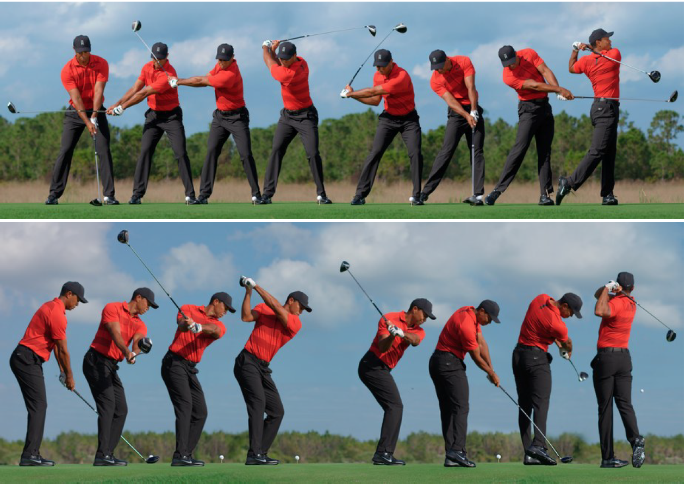
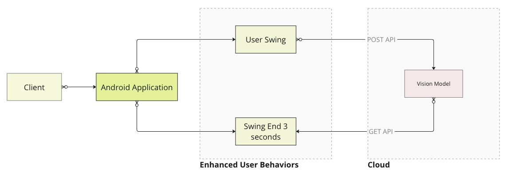
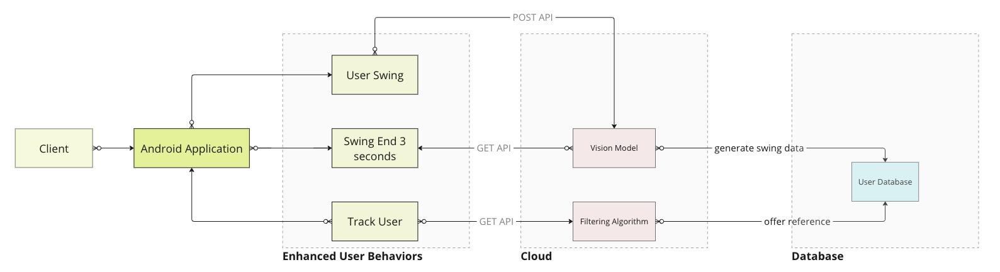
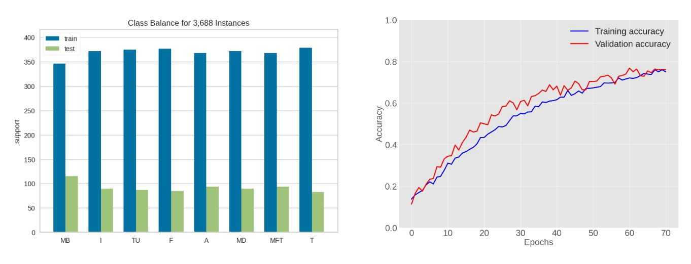

# Project Swing Coach

## Section 1: Program Description

### Tags

- Golf
- XR/AR

### Core Structures

- **Quest 3 Application**
  - track the swing of a XR golf player
  - visualize the proper swing plane
  - compare real vs ideal and calculate a score

## Unity Application

> **Are you looking to elevate your golf swing?**<br> **Ever found yourself puzzled about how to self-correct and optimize your swing path and stance?**<br>**Interested in comparing your swing path to that of a professional golfer, such as Tiger Woods?**

The Swingcoach application helps golfers to visualize a proper swing plane and execute a golf swing with this swing plane guide in their field of view. As a golfer, it is often quite difficult to self-diagnose issues and understand whether your technique is correct. The primary way golfers practice their swing is by going to the driving range and performing swing drills that help them understand the difference between "feel" and "real". Sometimes, it may feel like your swing is on plane from your point of view, but in reality a 3rd party observer could easily tell that it is not. This is one of the reasons it can be so useful to have a golf coach or to take videos of your swing. Each of these methods for training involves a few pain points. Videos are 2D in nature so multiple angles are required to understand how the swing looks an all axes. This can be quite cumbersome to setup or expensive to get equipment that makes it easy. Also, golf coaches can be quite expensive and only accessible for an hour or two at a time. Swingcoach allows golfers to easily view the "real" spatial data of how their swing was executed by showcasing a drawn line of their swing alongslide an ideal swing plane. Lastly, a score is calculated! This is score helps the golfer understand how close their swing was to the ideal swing plane. A higher score indicates a better swing, and a score of 100 indicates a near perfect swing!

In summary, with swingcoach, there is now an inexpensive and accessible options for golfers to practie their swings at all hours of the day with the important spatial data that will help them self-correct their swing without the need for expensive coaches or traveling to a driving range.

In the future we would like to add a few important features:

- Additional factors for visualization and calculating the score:
  - Controller/club rotation - we can showcase the ideal rotation of the controller/club at each point along the swing plane versus the actual rotation
  - Head movement - we can showcase the ideal movement and rotation of the golfers head at each point along the swing plane versus the actual movement and rotation
- A high score panel and a leaderboard for you and your friends
- A method for visualizing past swings and navigating through your progression
- Diagnose indivual parts of the swing and point the golfer to which stage of the swing requires correction

### Future Machine Learning Application

> **Are you looking to elevate your golf swing?**<br> **Ever found yourself puzzled about how to self-correct and optimize your swing path and stance?**<br>**Interested in comparing your swing path to that of a professional golfer, such as Tiger Woods?**

Swing Coach is your solution. Leveraging advanced computer vision and machine learning, we bridge the gap between your swing and that of the pros. Swing Coach offers you the unique opportunity to refine your swing path with precision and confidence, guided by the techniques of the masters.

This project explores how an XR Unity game program people learn the elite skills of golf swings. Golf sports require many techniques for the inexperienced ones to learn. This program tends to shrink the time for a golf learner to learn these skills and approach the level of those elite golfers. Although golf instructors could offer instant suggestions for golf learners, their advice might not clearly show the gap between a beginner and a pro. And beginners need some straightforward advice and instructions to help them finish a perfect golf swing. This application targets straightforward and professional instructions to help golf learners approach the level of professional golfers. Different user behaviors can be captured by the mobile application and the wearable AR/XR devices. The data interacts with the vision model that is deployed in the cloud with REST API, then the calculated results would be saved in a personal account in a remote database.

### Ergonomics & Biomechanics

<div style="display: flex; justify-content: center; align-items: center; height: 100vh; margin: 0;">
  
</div>

_The above image from left to right explain a swing procedure._

- Eight events exist in a golf swing: **Address**, **Toe-up**, **Mid-backswing**, **Top**, **Middownswing**, **Impact**, **Mid-follow-through**, and **Finish**.

According to the introduction of the GolfDB algorithm, golf swing events can be localized to a single frame using harsh event definitions. And eight contiguous events comprising a golf swing sequence as follows:

1. address(A): The moment just before the takeaway begins.
2. toe-up (TU): Shaft parallel with the ground during the backswing.
3. mid-backswing (MB): Arm parallel with the ground during the backswing.
4. top (T): The moment the golf club changes directions at the transition from backswing to downswing.
5. mid-downswing (MD): Arm parallel with the ground during the downswing.
6. impact (I): The moment the clubhead touches the golf ball.
7. mid-follow-through (MFT): Shaft parallel with the ground during the follow-through.
8. finish (F): The moment just before the golfer’s final pose is relaxed.

### Current Tech Stack

<br>

_the above diagram illustrates the future infrastucture of tech stack in this project_

- The current Unity Android application does not connect to the algorithm. The Androdid application creates a direct XR experience for the golf players. The application draws a clear perfect curve for the user

### Future Tech Stack

<br>
_the above diagram illustrates the future infrastucture of tech stack in this project_

- A mature version of this program tends to be based on **user experience**, **mobile application development**, **algoritom cloud deployment** and **database development**.
  <br><br>

## Section 2: Machine Learning

### Introduction

The algorithm is based on the [paper](https://arxiv.org/abs/1903.06528) from [GolfDB](https://github.com/wmcnally/golfdb). This **convolutional neural network** is trained by 1400 videos that record professional golfers' swings. The [dataset](https://drive.google.com/file/d/16WSzFWZlDg9oS3RHALfD37PD-5bhQMfz/view?usp=sharing) consists of diverse dimensions but no balance was detected in the original video datasets, so the original dataset went through the normalization.

### Target

1. Training of the Vision Model

- detect the common motion features of the pro golfers
- capture the motion data about the top golfers' swings

2. Testing of the Vision Model

- predict different phases of a golf swing

3. Use of the Vision Model

- analyze this XR golf player's swing frame-by-frame
- predict the phase of an XR golf player's swing

4. Data Analysis of the Vision Model

- swing compare: see the difference between an XR golf player and a top golfer
- data track: track the distribution and growth of an XR golf player

### Procedures

1. data collection: download the video dataset from the Kaggle data source
2. data pre-processing: pre-process the dataset with
3. data cleaning: clean some helpless and weight-less features from the dataset
4. feature engineering: upgrade and select the necessary features from the cleaned dataset
5. model training: train the CNN model with 75% of the dataset
6. model prediction: test the vision with the left 25% data
7. data analysis: analyze the vision model based on different visualization methods
8. user-data analysis: analyze an XR golf player's video with the pro's motion suggestions

### Model Performance

<br>
_The above diagrams illustrate the performance of the vision model in training, testing, and validation._

### Instructions

> 1. Download the compressed videos_160.zip from the link.
> 2. Download the algorithm .ipynb file from the Algorithm folder.
> 3. Download all the files from the data folder.
> 4. Load the algorithm file(.ipynb file) in **Google Colab**.
> 5. Download all the required dependencies in your environment.
> 6. Upload your video of a golf swing and all other data files into the sample_data folder.
> 7. **Replace the test video's file path with your test video path**.
> 8. Run all the Python scripts. (Please skip if you run across any un-working modules since these modules could expire.)

### Dependencies

> - numpy
> - pandas
> - sklearn
> - pytorch

### Citation

```
@article{McNally2019GolfDBAV,
  title={GolfDB: A Video Database for Golf Swing Sequencing},
  author={William J. McNally and Kanav Vats and Tyler Pinto and Chris Dulhanty and John J. McPhee and Alexander Wong},
  journal={2019 IEEE/CVF Conference on Computer Vision and Pattern Recognition Workshops (CVPRW)},
  year={2019},
  pages={2553-2562},
  url={https://api.semanticscholar.org/CorpusID:80628255}
}
```
# golf_swing
# golf_swing
